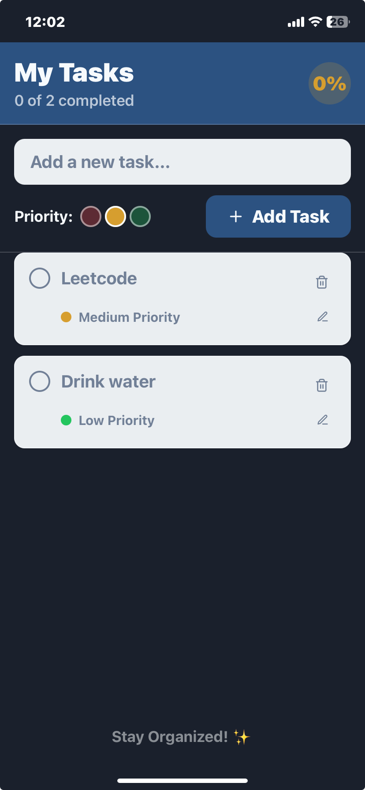

📱 My Tasks App
Author: John
Assignment: React Native Developer Assignment for AffWorld LLC
Submission Deadline: 11/06/2025

📋 Project Overview
"My Tasks" is a simple, clean, and efficient mobile task management app built with React Native and Expo. It allows users to add, complete, edit, delete, and prioritize tasks while receiving timely reminders through local notifications. The app fulfills all core requirements and implements several bonus features as specified in the AffWorld LLC assignment.

🚀 Features
✅ Core Functionality
Task Input: Add new tasks via a text input field with an "Add Task" button. Prevents empty submissions with user-friendly alerts.

Task List Display: View tasks in a scrollable, clean list.

Task Completion: Mark tasks as complete with a checkbox and visual strikethrough.

Delete Task: Remove tasks via a trash icon next to each item.

Local Notifications: Automatically schedules a notification 10 seconds after adding a task to remind users. Cancels notifications for completed tasks.

🌟 Advanced Features (Bonus)
Data Persistence: Save and retrieve tasks locally using AsyncStorage, so tasks remain after app closure.

Edit Task: Seamlessly edit existing tasks via an edit icon.

Task Prioritization: Assign High, Medium, or Low priority to tasks, with color-coded indicators:

🔴 High

🟡 Medium

🟢 Low

UI/UX Enhancements: Smooth fade-in/out animations on task addition and deletion, modern minimal design, and color-coded priorities.

Here’s a quick look at the "My Tasks" app interface and features:

Watch Demo Video
https://youtu.be/PZQNhsg2OL8

✔️ Add, edit, delete tasks  
✔️ Task prioritization with color tags  
✔️ Local notifications reminders  
✔️ Data persistence using AsyncStorage  

🛠️ Setup and Installation
📦 Prerequisites
Node.js: v14+

Expo CLI: Install globally

npm install -g expo-cli
Expo Go App: Available on iOS & Android app stores

📲 Steps to Run
Clone the Repository

git clone https://github.com/johnkhore5911/my-tasks-app.git
cd my-tasks-app
Install Dependencies

npm install
Start the Expo Development Server

npx expo start
Run the App

Open the Expo Go app on your mobile device.

Scan the QR code shown in your terminal.

Or run on a simulator:

npx expo start --ios
npx expo start --android
Grant Permissions

Allow notification permissions when prompted to enable task reminders.

🧠 Challenges and Design Choices
Notification Management:
Integrated Expo Notifications with a 10-second trigger for testing. Managed notification cancellation for completed tasks to enhance UX.

Data Persistence:
Implemented AsyncStorage with error handling for reliable JSON parsing and data management.

UI/UX Design:
Emphasized a clean, minimalistic interface with subtle animations to improve usability without impacting performance. Color-coded priorities for quick visual cues.

Error Handling:
Prevented empty task submissions with alerts for a seamless user experience.

📖 Notes
Uses React Hooks (useState, useEffect) for state management.

Modular, clean code with meaningful component and variable names.

Tested on both iOS and Android using Expo Go.

All required files are included for a smooth setup.

📬 Contact
For questions, suggestions, or feedback, reach out via:
john
johnkhore26@gmail.com